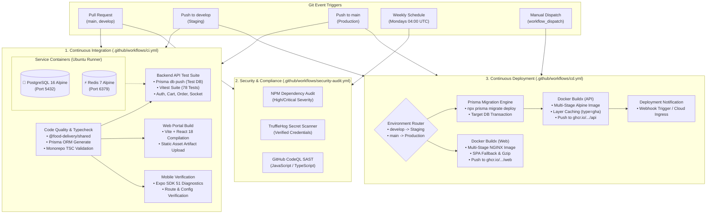

# FeastFlow: Enterprise CI/CD Pipeline Specification

This document provides a comprehensive technical overview of the **FeastFlow CI/CD Pipeline** built with **GitHub Actions**, **Docker Multi-Stage Builds**, and **GitHub Container Registry (GHCR)**.

---

## 1. Architectural Topology & Workflow Diagram



---

## 2. GitHub Actions Workflows Breakdown

### 2.1 Continuous Integration (`.github/workflows/ci.yml`)

The CI workflow validates every pull request and commit targeting `main`, `master`, and `develop`. It runs 4 concurrent or chained jobs:

1. **`quality-and-typecheck`**:
   - Sets up Node.js 20 LTS with automatic `npm` package caching.
   - Compiles `@food-delivery/shared` DTOs and interfaces first.
   - Generates the Prisma 7 client engine.
   - Executes TypeScript validation across web and mobile workspaces.

2. **`test-api`**:
   - Runs on an Ubuntu runner with native Docker service containers:
     - **PostgreSQL 16**: `postgres:16-alpine` with `pg_isready` healthcheck.
     - **Redis 7**: `redis:7-alpine` with `redis-cli ping` healthcheck.
   - Synchronizes test schema via `prisma db push`.
   - Executes all 9 test suites (78 integration & unit tests) using `vitest run`.

3. **`build-web`**:
   - Compiles the Vite + React 18 web portal into optimized production assets.
   - Uploads `apps/web/dist` as a GitHub Actions build artifact (`web-dist`) retained for 7 days.

4. **`verify-mobile`**:
   - Validates Expo SDK 51 configuration, dependencies, and native plugins (`expo-router`, `expo-secure-store`).

---

### 2.2 Continuous Deployment (`.github/workflows/cd.yml`)

The CD workflow orchestrates deployments based on branch conventions and manual controls:

| Event / Branch | Target Environment | Actions Executed |
| :--- | :--- | :--- |
| **Push to `develop`** | `staging` | Run Staging DB migrations, build & push Staging container tags (`staging-latest`, `staging-<sha>`). |
| **Push to `main`** | `production` | Run Production DB migrations, build & push Production container tags (`production-latest`, `production-<sha>`). |
| **`workflow_dispatch`** | *Selectable* | Operator selects `staging` or `production`, toggles API deploy, Web deploy, and migrations. |

#### Key Deployment Steps:
1. **Prisma Migration Execution**: Runs `npx prisma migrate deploy` using environment-scoped database secrets.
2. **Docker Buildx & GitHub Container Registry (GHCR)**:
   - Uses `docker/setup-buildx-action` with Docker layer caching (`type=gha`) for ultra-fast incremental builds.
   - Authenticates against `ghcr.io` using the native `GITHUB_TOKEN`.
   - Generates dual tags: semantic release tag and immutable Git commit SHA.
3. **Zero-Downtime Deployment Webhook**: Pings deployment webhooks (e.g. Render, Railway, AWS ECS, or Portainer) to roll out new container replicas.

---

### 2.3 Security & Quality Audit (`.github/workflows/security-audit.yml`)

Runs automatically every Monday at 04:00 UTC and on any PR modifying dependency manifests:
- **NPM Security Audit**: Flags high/critical vulnerabilities in transitive dependencies.
- **TruffleHog Secret Scanner**: Scans Git commits to verify no private keys, JWT secrets, or cloud tokens are committed.
- **GitHub CodeQL SAST**: Performs semantic static analysis on TypeScript and JavaScript code for injection flaws and security anti-patterns.

---

## 3. Container & Docker Infrastructure

### 3.1 Backend API Container (`docker/Dockerfile.api`)
- **Base Image**: `node:20-alpine` (Minimal attack surface).
- **Multi-Stage Build**:
  - `builder`: Compiles `@food-delivery/shared`, generates Prisma 7 client, and compiles TypeScript.
  - `runner`: Contains only compiled code and production dependencies.
- **Security**: Runs under a dedicated unprivileged user (`feastflow` / UID 1001).
- **Healthcheck**: Uses `wget` to query `/health` every 30 seconds.

### 3.2 Web Portal Container (`docker/Dockerfile.web` & `docker/nginx.conf`)
- **Base Image**: `nginx:1.25-alpine`.
- **Performance**:
  - Gzip compression enabled for JS, CSS, SVG, JSON.
  - Immutable 1-year cache headers for hashed bundle assets in `/assets/`.
- **Routing**: Single Page Application (SPA) fallback (`try_files $uri $uri/ /index.html`).
- **Security Headers**: Injects `X-Frame-Options`, `X-Content-Type-Options`, and `Referrer-Policy`.

### 3.3 Full-Stack Local Orchestration (`docker-compose.yml`)
To spin up the entire FeastFlow platform locally (PostgreSQL 16 + Redis 7 + API Server + Web Portal):

```bash
# Start all services in the background
docker-compose up -d --build

# View real-time logs
docker-compose logs -f api web

# Verify service health
docker-compose ps
```

---

## 4. Required GitHub Repository Secrets & Variables

To enable the CD pipeline and migrations, configure the following secrets under **Settings $\rightarrow$ Secrets and variables $\rightarrow$ Actions**:

### GitHub Actions Secrets
| Secret Name | Scope | Description |
| :--- | :--- | :--- |
| `DATABASE_URL` | Environment (`production` / `staging`) | PostgreSQL connection string for Prisma migrations. |
| `DEPLOY_WEBHOOK_URL` | Environment (`production` / `staging`) | Webhook URL to trigger container pull & restart on hosting provider. |
| `JWT_ACCESS_SECRET` | Environment (`production` / `staging`) | Secret key used to sign Access JWT tokens (min 32 chars). |
| `JWT_REFRESH_SECRET` | Environment (`production` / `staging`) | Secret key used to sign Refresh JWT tokens (min 32 chars). |
| `EXPO_TOKEN` | Repository | Expo token if automating mobile builds via EAS CLI. |

### GitHub Actions Variables
| Variable Name | Scope | Default Value | Description |
| :--- | :--- | :--- | :--- |
| `VITE_API_URL` | Environment | `/api/v1` | Base API URL injected into Web build. |
| `VITE_WS_URL` | Environment | `""` | WebSocket server URL for real-time Socket.IO. |

---

## 5. Local Workflow Testing with `act`

You can test the GitHub Actions CI pipeline locally without pushing to GitHub by using [`act`](https://github.com/nektos/act):

```bash
# Run the CI pipeline locally using Docker
act pull_request -W .github/workflows/ci.yml

# Run only the API test job
act -j test-api
```
